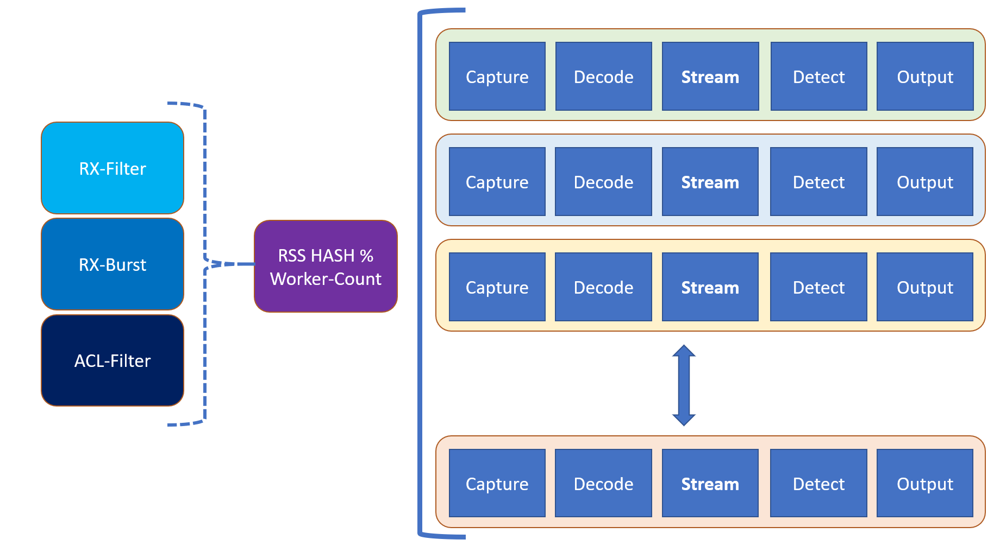
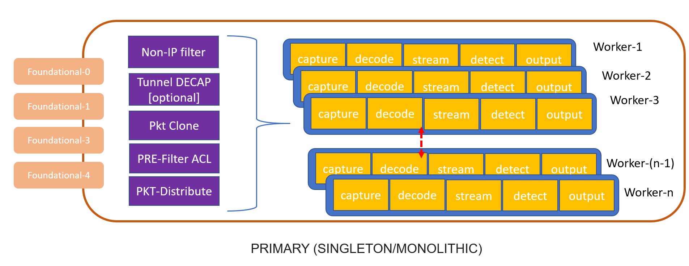
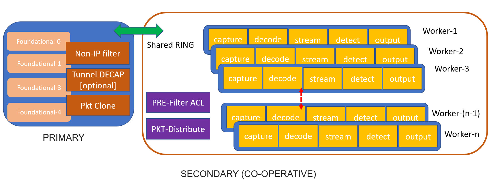
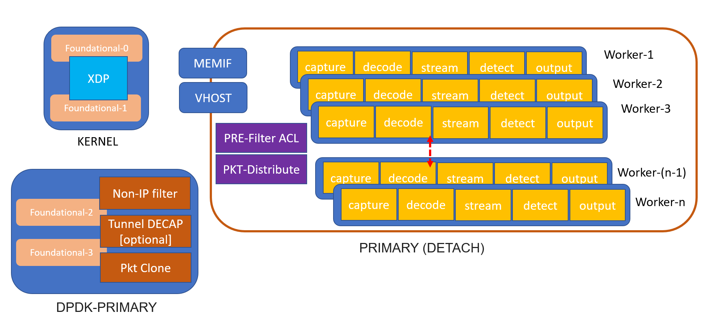

# DPDK_SURICATA-4_1_4

porting ACL from 3.0 - work in progress

## Motivation

Create simple DPDK RX-TX to allow packets into SURICATA processing pipeiline mode. 



# Things to do
 - [ ] flatten the packet buffer for full zero-copy mode.
 - [ ] use zero copy for paylaod, PKT decode and other layers
 
# Work in progress
  - [x] use SW ACL for classification on directional rules from `https://github.com/vipinpv85/DPDK-Suricata_3.0`.

# Things completed
 - [x] implement SW or HW Symmetric Hashing for reassembled packets.
 - [x] move dpdk config to `suricata.yaml`
 - [x] allow multiple worker rather than single worker
 - [x] allow multiple RX queue with RSS (default)
 - [x] add dpdk fields to suricata.yaml
 - [x] migrate to DPDK 19.11.1 LTS
 - [x] use rx-callback to filter packets which are non-ip
 - [x] cleanup logs and debug points

## How to Build?

### dependency 
 - https://suricata.readthedocs.io/en/suricata-4.1.2/install.html
 
### version: 
| software | release |
| -- | -- |
| DPDK | dpdk-stable-19.11.3 |
| Suricata | suricata-4.1.4 |

### Build and Run

#### DPDK 19.11.3
- Download DPDK from dpdk.org.
- Untar DPDK tar file.
- Execute the following commands
```
 cd <to unatar dpdk folder>
 make config T=x86_64-native-linuxapp-gcc O=x86_64-native-linuxapp-gcc
 export RTE_SDK=$PWD
 export RTE_TARGET=x86_64-native-linuxapp-gcc
 cd x86_64-native-linuxapp-gcc
 make -j 4
```
- Test the custom build by cross checking examples like helloworld & l2fwd.

#### modified suricata:

| steps | explanation |
| -----|-----|
| `autoconf` | to build the configure script with DPDK support |
| `./configure --enable-dpdk` | makes configuration with dpdk |
| `make -j 10` | build suricata with 10 threads |

## How to Run?

| command | purpose |
| -----|-----|
| `./src/suricata --build-info; ./src/suricata --list-runmodes` | get suricata version and supported modes |
| `./src/suricata --list-dpdkports` | list DPDK available ports |
| `./src/suricata --dpdk` | Run DPDK suircata with mysuricata.cfg |

## How to run on multiple NUMA sockets

 - DPDK API makes use of Huge pages
 - Pin the memory to per NUMA by editing EAL args
 - Pin the worker threads by eiditing affinity in suricata.yaml

1. edit suricata.yaml 
2. Search for `dpdk`
3. under EAL append options '--socket-mem=1,1024' and '--scoket-limit=1,1024' for NUMA-1
4. under cpu-affinity update `worker-cpu-set` for desired NUMA-1 threads

## Work item in discussion with SURICATA team to merge
```
Introduction:
1. DPDK is set of Hardware and Software library, that helps to run on userspace.
2. DPDK process is classified as Primary & Secondary, where huge pages and devices are shared between them.
3. For an existing application to be support DPDK; both build and code is to be changed.
4. One can skip the DPDK lcore-threads and service-threads too. But has to invoke `rte_eal_init` and relevant library call.

What mode to use: (to be decided - which one to support and start)

1. Primary (singleton/monolithic):
```



```
Pros:
a) Suricata will run as Primary managing all DPDK PMD and Libraries.
b) Requires access to hugepages and root permission.
c) Does not need ASLR to be disabled.
d) can run in baremetal CPU, VM, Docker too.
e) can make use DPDK secondary apps like proc-info, pdump, any other custom secondary application.
Cons:
a) pausible to run as non root, but requires DPDK familirity.
b) code becomes bulky.
c) HW vendor or device offload, code needs to updated with generic API or SW fallback.

2. Seocndary:
```



```
Pros:
a) Suricata will run as Secondary with zero or a little managment and setup code for PMD and Libraries.
b) Requires access to hugepages and root permission.
c) ASLR needs to be disabled, for consistent or hiigher chance of start.
d) can run in baremetal CPU, VM, Docker too.
e) Code becomes lighter.
Cons:
a) plausible to run as non-root, but requires DPDK familiarity.
b) cannot make use of DPDK secondary apps like proc-info, pdump, any other custom secondary application.
c) Need to probe the configuration settings for HW vendor or device offload.

3. Detached Primary:
```



```
Pros:
a) Suricata will run as Primary, getting packets from another DPDK primary via memif/vhost/AF_XDP interface.
b) Requires access to huge pages and root permission.
c) can run in bare-metal CPU, VM, Docker too.
d) Code becomes lighter because we are using SW generic NIC and offloads.
e) all vendor-specific and non DPDK offloads can be run on the alternative process.
f) Useful in scenarios where selected packet mirror can be implemented in HW, or SW and fed to DPDK.
g)
Cons:
a) plausible to run as non-root, but requires DPDK familiarity.
b) secondary apps like proc-info, pdump, any other custom secondary application works.
c) can make use of XDP (eBPF) to redirect selected traffic too.

How to do:
1. There are ABI and API changes across DPDK releases.
2. Use a long term stable release as de-facto for DPDK. example 19.11.1 LTS.
3. Depending upon individual or distro releases not all NIC, HW or features are enabled.
4. Identify and choose the most common NIC like memif/Pcap/tap/vhost for ease of build.
5. Update `configure.ac` to reflect
a) $RTE_SDK & $RTE_TARGET for custom or distro dpdk package.
b) edit for new field `--enable-dpdk` as flag
c) add necessary changes for CFLAGS and LDFLAGS if flag is enabled.
6. Add Compiler flag `HAVE_DPDK` to build for DPDK mode.
7. Start for single and multi worker mode.
8. Code changes in
a) suricata.c: for DPDK initialization, run-mode registration, parse of suricata.yaml for DPDK sections and add-hook to Rules Add for DPDK ACL.
b) source-dpdk, run mode-dpdk: new files to support DPDK configuration and worker threads.

Proof of concept with single worker mode: https://github.com/vipinpv85/DPDK-Suricata_3.0
ongoing work with multi-worker: https://github.com/vipinpv85/DPDK_SURICATA-4_1_1

Performance: by redirecting rule match packets to worker threads
1. 1 worker can perform around 1.25 Mpps
2. 10Gbps with line rate (64byte) we need to 14 workers with each worker having 1Mpps flows
3. 40Gbps with line rate (128byte) we need 30 worker threads with 1Mpps flows each.

```
